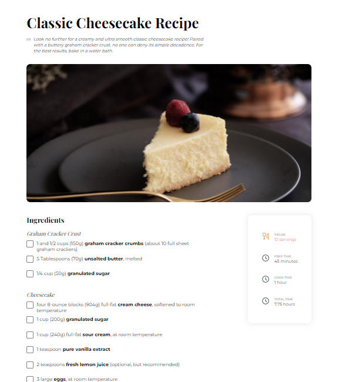

<!-- Please update value in the {}  -->

<h1 align="center">Classic Cheesecake Recipe</h1>

<div align="center">
   Solution for a challenge from  <a href="http://devchallenges.io" target="_blank">Devchallenges.io</a>.
</div>

<div align="center">
  <h3>
    <a href="https://CarmenOcotan/Cheesecake-recipe">
      Demo
    </a>
    <span> | </span>
    <a href="https://github.com/CarmenOcotan/Cheesecake-recipe">
      Solution
    </a>
    <span> | </span>
    <a href="#">
      Challenge
    </a>
  </h3>
</div>

<!-- TABLE OF CONTENTS -->

## Table of Contents

- [Overview](#overview)
  - [Built With](#built-with)
- [How to use](#how-to-use)
- [Contact](#contact)


<!-- OVERVIEW -->

## Overview



- Made with HTML and CSS ..  
- Not responsive


## How To Use

To clone and run this application, you'll need [Git](https://git-scm.com) and [Node.js](https://nodejs.org/en/download/) (which comes with [npm](http://npmjs.com)) installed on your computer. From your command line:

```bash
# Clone this repository
$ git clone https://github.com/CarmenOcotan/Cheesecake-recipe.git

# Install dependencies
$ npm install

# Run the app
$ npm start
```


## Contact

- GitHub [@CarmenOcotan](https://github.com/CarmenOcotan/)
- LinkedIn [@carmen-ocotan](https://www.linkedin.com/in/carmen-ocotan/)
